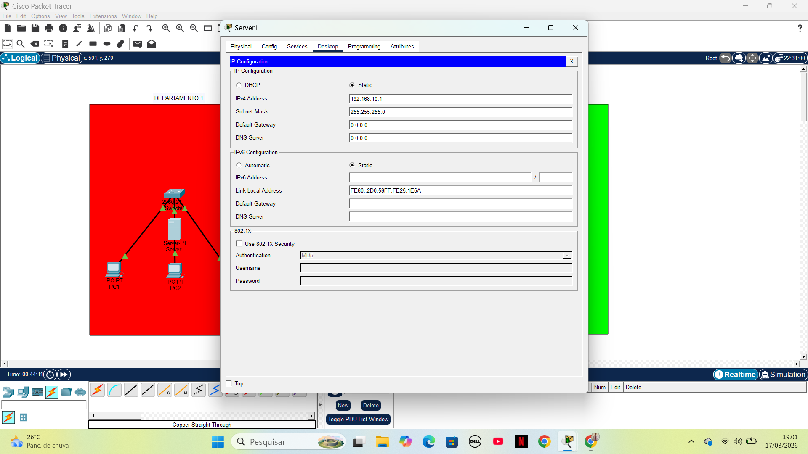
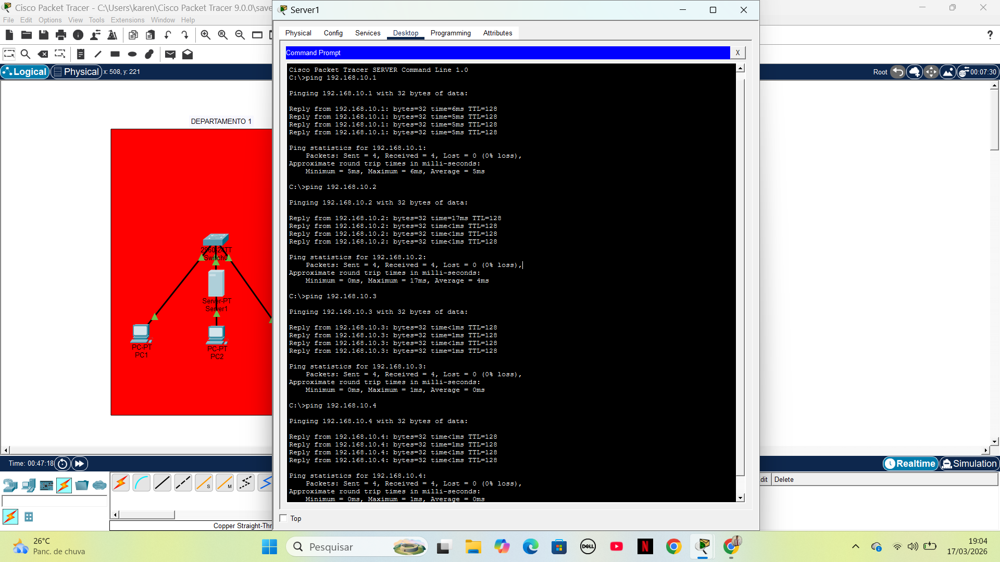

# VLAN and DHCP Configuration Lab

## Overview
This lab demonstrates how to configure VLANs and DHCP using Cisco Packet Tracer.

## Objective
- Create VLANs
- Configure DHCP
- Test connectivity between devices

## Network Topology

## Configuration
- VLAN 10 and VLAN 20 created
- Ports assigned to VLANs
- DHCP pools configured

## Testing

## Result
Devices successfully received IP addresses and communicated correctly.

## Tools Used
- Cisco Packet Tracer
